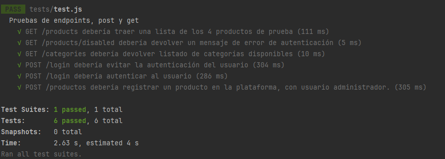

# El patrón del hard | Backend

## Instalación 
### Pre-requisitos:

* NodeJS y NPM instalados en el dispositivo.
* sequelize-cli instalado ``` npm install --save-dev sequelize-cli ```
* MySQL / MariaDB instalado en el dispositivo.
* Base de datos creada con un nombre determinado, que deberá corresponder al que sea configurado posteriormente en el archivo /config/config.json

---

### Procedimiento de instalación:

1. Clonar el repositorio de backend desde https://github.com/francobidart/dsw-tp-backend
2. Ingresar al directorio de backend y ejecutar el comando ``` npm install ```
3. Configurar los datos USERNAME, PASSWORD, DATABASE Y PORT en el archivo /config/config.json con los datos correspondientes a la base de datos.
4. Ejecutar las migraciones para crear la estructura básica de datos con ``` sequelize-cli db:migrate ```


#### Instalación de información de prueba

En este proyecto se encuentra incluido un conjunto de datos iniciales útiles para la realización de pruebas.

**Importante:** La utilización de esta herramienta **borrará la información que se encuentra almacenada actualmente** en la 
base de datos.

Para cargar los datos de prueba es **necesario** que la base de datos se encuentre creada (no es necesario que contenga información).

Para utilizar la herramienta deberá ejecutar los siguientes comandos en el directorio raíz del proyecto backend:

```
npx sequelize-cli db:migrate:undo:all
npx sequelize-cli db:migrate
npx sequelize-cli db:seed:all
```

Al finalizar la ejecución, la estructura de datos habrá sido creada nuevamente, las migraciones habrán sido aplicadas y se incluirán datos
de prueba para los siguientes elementos:

* Usuarios de prueba
  * Cliente: 
    * Usuario: **test@test.com**
    * Contraseña: **admin**
  * Administrador: 
    * Usuario: **admin@test.com**
    * Contraseña: **admin**
* Categorías de producto:
  * Procesadores
  * Discos sólidos
  * Memorias RAM
  * Otros
* Medios de pago
  * Efectivo
  * Transferencia bancaria
* Productos de prueba (4)
* Sucursales (2)
* Estados de pedido
  * Generado
  * Pendiente de pago
  * Cobrado (pendiente de entrega)
  * Entregado
  * Cancelado

Con esta información inicial es posible lanzar la aplicación y ejecutar los diferentes casos de uso disponibles:

* Registro de usuarios
* Login/logout
* Listado de productos
* Búsqueda de productos
* Comprar productos
* Ver información de pedidos
* Acceder al administrador, con las siguientes funciones
  * ABM Productos
  * ABM Sucursales
  * ABM Medios de Pago
  * Listado de pedidos
    * Entrega de pedidos
    * Cancelación de pedidos
  * ABM Usuarios

---

### Ejecución de la aplicación

Para ejecutar la aplicación, luego de realizada la carga inicial de datos, deberá ejecutar el siguiente comando desde el directorio raíz del proyecto de backend:

```
node app.js
```

Por defecto, y si el puerto se encuentra disponible, el servidor de backend se ejecutará en http://localhost:3000

### Consideraciones acerca de CORS y politicas de acceso

Es importante aclarar que la aplicación se encuentra protegida por politicas CORS, los origenes permitidos se encuentran definidos en el archivo /app.js dentro de la variable _corsOptions_.

Los valores permitidos por defecto son:

* **localhost:4200** (Puerto por defecto de Angular).
* **localhost:3000** (Puerto por defecto de Express).

De ser necesario, realice los ajustes correspondientes para la correcta ejecución de la aplicación desde la variable mencionada anteriormente.

---

### Documentación de API:

Utilizamos Swagger UI para la documentación de APIs, se encuentra disponible 
al correr la aplicación en la ruta /api-docs

Se encuentran documentados todos los endpoints disponibles, agrupados por el tipo
de request. 

Las opciones disponibles son:

* Sesión
* Productos
* Categorías
* Sucursales
* Medios de pago
* Pedidos
* Clientes y usuarios

### IMPORTANTE

La aplicación utiliza autorización por JWT, almacenados en una cookie que se envía al iniciar sesión.

Es importante para poder utilizar correctamente los endpoints se realice previamente el login correspondiente, para hacerlo deberá:

1. Ingresar a Swagger UI en http://localhost:3000/api-docs
2. Expandir la sección "Sesión"
3. Expandir el endpoint POST /login
4. Seleccionar "Try it out"
5. Ingresar un usuario y contraseña (utilizar como referencia los mencionados anteriormente)
6. Seleccionar "Execute"
7. Verificar que la respuesta indique _Usuario identificado correctamente_

Una vez realizada la autenticación, podrá utilizar los endpoints que requieran autorización.

Algunos endpoints solo permiten el acceso con usuarios administradores. En caso de que se haya logueado con un usuario cliente, puede utilizar el endpoint _GET /logout_ para finalizar la sesión e ingresar con el usuario adecuado.

En caso de no haber ingresado con un usuario administrador, estas rutas enviarán la siguiente respuesta:

```
{
  mensaje: 'El usuario no posee los permisos requeridos para acceder a este recurso.'
}
```

---

### Tests automáticos de backend

Utilizamos las siguientes librerías para la definición de pruebas automatizadas
* Jest
* Supertest

Se definió un conjunto básico de 6 pruebas, que verifican los siguientes elementos:

* Peticiones GET sin autorización, a endpoints de Productos y Categorías
* Peticiones POST para el manejo de sesiones, login de usuarios
* Peticiones POST para el registro de un producto, con autenticación de administrador.

Para ejecutar las pruebas se utilizan los datos iniciales mencionados previamente, para ejecutar los tests realice el siguiente comando en la carpeta
raíz del proyecto backend:

```
npm test
```

#### Imagen de verificación de resultados de la ejecución de las pruebas:

